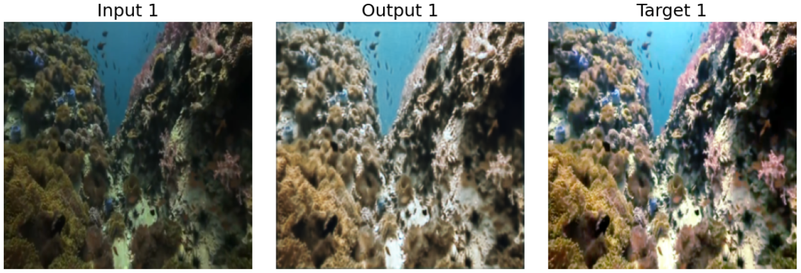
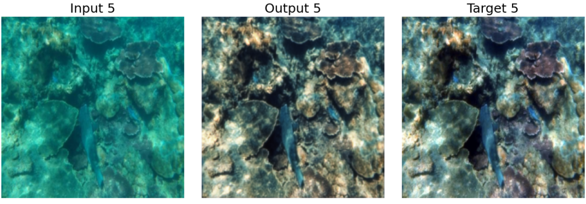

# 🌊 Enhanced Water-Net for Underwater Image Enhancement

> An enhanced Water-Net model for underwater image enhancement, incorporating **SE Blocks** for improved feature recalibration. Trained and evaluated on the **UIEB** dataset.

---


## 🌟 Key Results: Visual Comparison

The model significantly corrects color cast (the dominant blue/green tint) and improves the contrast and visibility of underwater images. Below are visual comparisons demonstrating the effectiveness of the **SE-Water-Net** against ground truth references.

<table align="center">
 <tr>
    <td align="center"><b>Input - Enhanced - Reference</b></td>
 </tr>
 <tr>
    <td></td>
 </tr>
 <tr>
    <td></td>
 </tr>
 <tr>
    <td></td>
 </tr>
</table>

---

## 📊 Quantitative Results (Evaluation)

To objectively prove the model's effectiveness, the enhanced images **were evaluated** against the ground truth references using two key industry-standard metrics:

* **PSNR (Peak Signal-to-Noise Ratio):** Measures the ratio between the maximum possible power of a signal and the power of corrupting noise. **Higher is better.**
* **SSIM (Structural Similarity Index):** Measures the similarity between two images (**the model's output** vs. the reference). It focuses on changes in structure, luminance, and contrast. **A value closer to 1 is better.**

The **SE-Water-Net** achieves excellent scores, demonstrating a high-fidelity restoration of the original image quality, as summarized in the results below.

<p align="center">
  
</p>

---

## 🎯 The Problem

Underwater images suffer from severe quality degradation due to light absorption and scattering. This results in:
* **Color Cast:** A dominant blue or green tint that washes out other colors.
* **Low Contrast:** A hazy or foggy appearance.
* **Poor Visibility:** Difficulty in discerning details.

---

## 💡 Solution Architecture: SE-Water-Net

This project uses an improved version of **Water-Net**, a well-known architecture for this task. This architecture **was enhanced** by integrating **Squeeze-and-Excitation (SE) Blocks**.

**Why SE Blocks?**
SE blocks allow the network to perform **dynamic feature recalibration**. In simple terms, they help the model "learn" which visual features (like edges, textures, or color channels) are more important and "excite" them, while "squeezing" or suppressing less relevant features. This leads to a more accurate and visually pleasing restoration.

---

## 📊 Dataset

The model was trained and evaluated on the **UIEB (Underwater Image Enhancement Benchmark)** dataset. This benchmark is a large-scale dataset containing thousands of real-world underwater images paired with high-quality, clear reference images, making it ideal for supervised learning.

---

## 🛠️ Technologies & Libraries Used

* **Language:** Python 3.x
* **Environment:** Google Colab (Jupyter Notebook)
* **Deep Learning Frameworks:** PyTorch
* **Libraries:**
    * OpenCV (for image processing)
    * NumPy
    * Matplotlib (for visualization)
    * scikit-image (SSIM/PSNR metrics)

---

## 🏃 Getting Started

To run this project:
* Open the main notebook (in the `src/` folder) and run the cells.


حتماً. این بخش خیلی مهمی است. نسخه قبلی شما ناقص بود چون مهم‌ترین قدم، یعنی **نصب نیازمندی‌ها**، در آن نبود.

````
این هم نسخه اصلاح‌شده و حرفه‌ای برای بخش `## 🏃 Getting Started` (به زبان انگلیسی، مطابق با بقیه `README` شما):

---

### کد جدید (این را جایگزین بخش قبلی کنید):

```markdown
## 🏃 Getting Started

To run this project on your local machine, follow these steps:

1.  **Clone the repository:**
    ```bash
    git clone [Your GitHub Repository URL]
    cd [Your-Project-Folder-Name]
    ```
2.  **Install the required dependencies:**
    All dependencies are listed in the `requirements.txt` file. Install them using pip:
    ```bash
    pip install -r requirements.txt
    ```
3.  **Run the notebook:**
    Now, you can open the main notebook (located in the `src/` folder) and run all the cells.


---

## 💾 Models & Dataset

**Note:** You do not need to manually download these models or the dataset. The code is set up to automatically fetch the necessary files when you run it.

However, for those who wish to have the files directly:

* **Trained SE-Water-Net Model:** [Google Drive Link](https://drive.google.com/file/d/1DiT9wS7kbYPpbSbxYVqUIM87FALwFOMp/view?usp=sharing)

* **Pre-processed UIEB Dataset (Zipped):** [Google Drive Link](https://drive.google.com/file/d/1adx6d7BNMc7KqHA5hLaInRkiZiYDGoZO/view?usp=sharing)
    * **Note on this file:** This is a custom `.zip` archive. It was created by combining the original "Raw" and "Reference" datasets (see below), and then splitting the combined data into `train` and `validation` sets.

* **Original UIEB Raw Dataset (Kaggle):** [Kaggle Link](https://www.kaggle.com/datasets/larjeck/uieb-dataset-raw)

* **Original UIEB Reference Dataset (Kaggle):** [Kaggle Link](https://www.kaggle.com/datasets/larjeck/uieb-dataset-reference)

  
---

## 👤 Author

* **Reza Ghayedi**
* **LinkedIn:** www.linkedin.com/in/rezaghayedi
